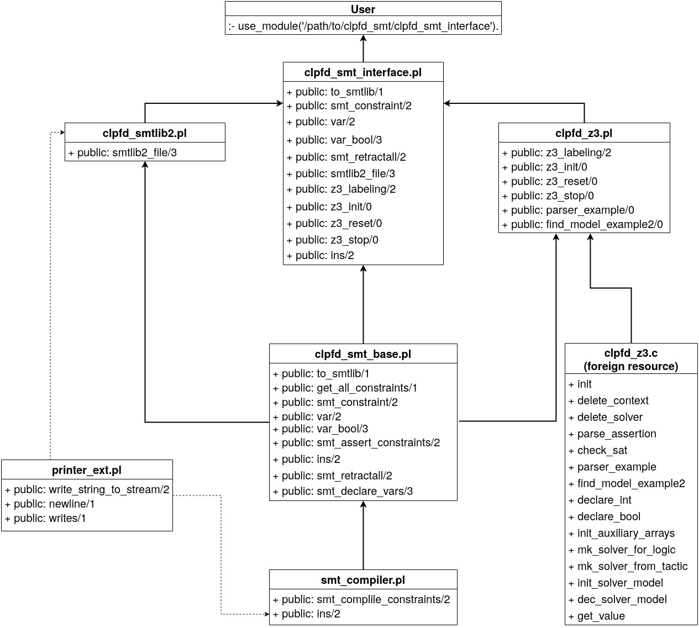

# clpfd_smt
clpfd_smt is a module that enables SMT solving for CLP(FD) constraints in (SICStus) Prolog.


clpfd_smt provides predicates, so that by simple code adaptations 
one can either generate equivalent SMT-LIB2 code, or directly interface
to Z3 to solve constraints.

Integrating other SMT solvers is easily feasible.

The following chart demonstrates the software layout.





## Installation and Compilation
In order to use only the predicates to generate SMT-LIB2 code, without interfacing to Z3
you can simply load clpfd_smt using
 :- use_module('/path/to/clpfd_smt_interface').

The Z3 interface however utilizes a C-API. Thus it is necessary to compile the interface.
You can use the makefile like this:
```
 make Z3_INCLUDE_PATH=/home/$USER/z3/src/api/z3.h \
    Z3_LIB_PATH=/home/$USER/z3/build/
```
Or you can use the SICStus splfr utility.


## Usage

A number of SICStus Prolog CLP(FD) benchmarks have been adapted to using the
clpfd_smt module.
More complex examples than the following are available in the benchmarks folder above.


### Z3
The following steps show how to convert a CLP(FD) codebase to use Z3:
1. Load the clpfd_smt_interface instead of library(clpfd).
2. Add Z3 control structures ( Z3_init/0 , Z3_reset/0 , Z3_stop/0).
3. Wrap constraints with to_smtlib/1.
4. Replace labeling/2 with z3_labeling/2.

Example:
```
:- use_module(library(clpfd)).

donald(Lab, Consistency):-
	LD=[D,O,N,A,L,G,E,R,B,T],
	domain(LD,0,9),
	domain([D,G],1,9),
	all_different(LD, Opt),
	scalar_product([ 100000, 10000, 1000, 100, 10, 1,
			         100000, 10000, 1000, 100, 10, 1,
			        -100000,-10000,-1000,-100,-10,-1],
		            [D,O,N,A,L,D,
			         G,E,R,A,L,D,
			         R,O,B,E,R,T], 
                     #=, 0),
	labeling(Lab,LD),
	writeq(LD),
	nl.
```

becomes this:

```
:- use_module('/path/to/clpfd_smt_interface').

donald(_Lab, Consistency):-
	z3_reset,
    LD  = [D,O,N,A,L,G,E,R,B,T],
    to_smtlib([
        domain(LD, 0, 9),
        domain([D, G], 1, 9),
        all_different(LD, Opt),
        scalar_product([ 100000, 10000, 1000, 100, 10, 1,
                         100000, 10000, 1000, 100, 10, 1,
                        -100000,-10000,-1000,-100,-10,-1],
                        [D,O,N,A,L,D,
                         G,E,R,A,L,D,
                         R,O,B,E,R,T], 
                        #=, 0)
    ]),
	z3_labeling([logic('QF_FD')], LD),
	writeq(LD),
	nl,
    z3_stop.

```


### Generating SMT-LIB2 code
In order to generate files with SMT-LIB2 code follow these code
transformation steps:
1. Load the clpfd_smt_interface instead of library(clpfd).
2. Wrap constraints with to_smtlib/1.
3. Replace labeling/2 with smtlib2_file/3, where the third argument is the filename of the file to write to. Existing files are overwritten.

The previous examples becomes this:

```
:- use_module('/path/to/clpfd_smt_interface').

donald(_Lab, Consistency):-
    LD  = [D,O,N,A,L,G,E,R,B,T],
    to_smtlib([
        domain(LD, 0, 9),
        domain([D, G], 1, 9),
        all_different(LD, Opt),
        scalar_product([ 100000, 10000, 1000, 100, 10, 1,
                         100000, 10000, 1000, 100, 10, 1,
                        -100000,-10000,-1000,-100,-10,-1],
                        [D,O,N,A,L,D,
                         G,E,R,A,L,D,
                         R,O,B,E,R,T], 
                        #=, 0)
    ]),
    Filename = 'donald.smt2'
	smtlib2_file([], LD, Filename),
	writeq(LD),
	nl.
```

## Supported Constraints
* [All arithmetic expressions](https://sicstus.sics.se/sicstus/docs/latest4/html/sicstus/Syntax-of-Arithmetic-Expressions.html)
* [Arithmetic constraints](https://sicstus.sics.se/sicstus/docs/latest4/html/sicstus.html/Arithmetic-Constraints.html):
  * scalar_product/[4,5]
  * sum/3
* [Membership constraints](https://sicstus.sics.se/sicstus/docs/latest4/html/sicstus.html/Membership-Constraints.html):
  * domain/3
  * in/2
  * in_set/2
* [All propositional constraints](https://sicstus.sics.se/sicstus/docs/latest4/html/sicstus.html/Propositional-Constraints.html)
* [Arithmetic-Logical Constraints](https://sicstus.sics.se/sicstus/docs/latest4/html/sicstus.html/Arithmetic_002dLogical-Constraints.html):
  * count/4
  * global_cardinality/[2,3]
    * global_cardinality option cost/2 is not supported
  * all_different/[1,2]
  * all_distinct/[1,2]
  * bool_and/2
  * bool_or/2
  * bool_xor/2
  * bool_channel/4
  * lex_chain/1

Reification of constraints is supported.

## Garbage Collector

In some cases clpfd_smt fails without throwing an error.
That is most likely due to the garbage collector being invoked, which destroys unground variables as well. 
Currently the internal represantion relies on variables not being garbage collected.
This issue only occurs with large benchmarks.

You can turn the garbage collector off using:
```
set_prolog_flag(gc,off).
```


## Prolog compatibility
clpfd_smt does in some predicates use logical for-loops. Those are not compatible with 
SWI-Prolog. A minor refactor would solve that issue.

The smt_compiler uses the SICStus predicate range_to_fdset/2 to convert ranges from in/2 terms
to fd_sets. fd_sets are easier to compile.
An alternative predicate that implements a generally compatible "con2smt(in(Var, Range), SMT)"
is commented out.
